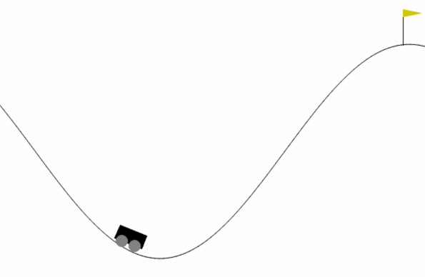

**Mountain Car Q-Learning** 🚗⛰️

A Reinforcement Learning agent that solves the classic MountainCar-v0 environment using a Tabular Q-Learning approach with Optimistic Initialisation. A demo can be seen here:

🧠 **Project Overview**

The Mountain Car problem is a control task where an underpowered car must drive up a steep hill. As gravity is stronger than the car's engine, it must learn to build momentum by rocking back and forth.

This implementation uses Tabular Q-Learning to solve the environment without deep neural networks.

**Key Technical Features**

State Discretisation: Converted the continuous state space (Position: -1.2 to 0.6, Velocity: -0.07 to 0.07) into a discrete 30x30 grid.

Optimistic Initialisation: Initialised the Q-Table with all zeroes. Since step rewards are -1, the agent treats unvisited states as promising, which encourages exploration.

📊 **Results**

The agent typically solves the task at around episode 3,000.

🛠️ **Installation & Usage**

1. Clone the repository

2. Install Dependencies: pip install -r requirements.txt

3. Train the Agent (Optional - Pre-trained model included)

4. python train.py

5. Watch the Agent Play

6. python play.py

📂 **File Structure**

train.py: Main training loop with Epsilon-Greedy strategy and Q-table updates.

play.py: Inference script to visualise the agent's performance.

qt.npy: The saved NumPy Q-table (The "Brain").

requirements.txt: Python dependencies.

🚀 **Future Improvements**

Deep Q-Network (DQN): Implement a neural network to handle continuous state spaces without manual discretisation.

Double Q-Learning: Implement Double Q-Learning to reduce maximisation bias.

📝 **License**

This project is licensed under the MIT License.

👤 **Author**

Patrick Tembo
